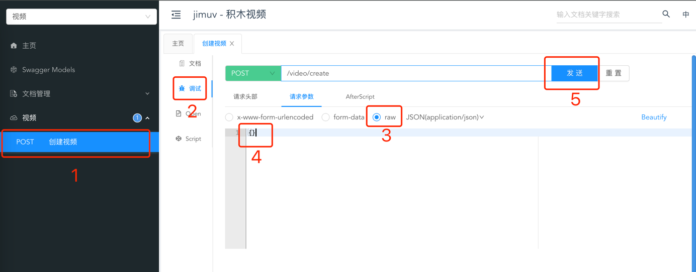

<div align="center">

# 🎬 JimuV - 积木视频

**创作视频就像拼接积木一样简单！**

*Creating videos is as easy as piecing together building blocks!*

[](https://opensource.org/licenses/MIT)
[](https://www.oracle.com/java/)
[](https://spring.io/projects/spring-boot)
[](https://github.com/bytedeco/javacv)
[](https://ffmpeg.org/)

**🇨🇳 中文** | [**🇺🇸 English**](README-EN.md)

</div>

---

## 💡 设计理念

> 雕塑家，在动手之前，脑中早已"看见"作品的模样；  
> 画家，在落笔之前，也已清楚画面会如何呈现。  
> **视频创作，理应也是如此。**

你是否也有过这样的体验：
- *"前5秒放一段视频，第6秒切画面，背景音乐3秒换轨..."*
- 一切清晰、准确，却卡在时间轴里剪来剪去...

### 🧩 JimuV 让视频创作回归本质

**只需一份 JSON 配置**，描述你的创作思路：
- 什么时间播放什么内容
- 如何展示画面效果
- 配什么音乐和文字

**剩下的交给JimuV**：自动拼接画面、同步声音、调整节奏。
像拼接积木一样，**干净、准确、不跑偏**。

### 🚀 不只是剪辑工具

**JimuV = 创作思路的翻译器**

用写作的方式创作视频，让思考本身变成生产力。

---

## 📖 产品简介

JimuV 是一个**基于 REST API** 的智能视频创作平台。通过简单的 API 调用，将文本、音频、图片、视频等多种素材进行智能组装，自动生成高质量的视频内容。

### ✨ 核心特性

| 特性 | 描述 |
|------|------|
| 🚀 **一键生成** | 单个 API 调用完成复杂视频制作 |
| 📝 **JSON 驱动** | 一条 JSON 配置渲染一个完整视频 |
| 🎨 **多素材融合** | 文本、音频、图片、视频元素自由组合 |
| 🔧 **开箱即用** | 内置丰富的默认规则，零配置快速启动 |
| ⚡ **高性能处理** | 异步处理架构，支持高并发任务 |
| 🎭 **丰富特效** | 内置多种视觉效果和动画系统 |

---

## 🚀 快速开始

### 📋 环境要求

| 组件 | 版本要求 |
|------|----------|
| **Java** | 1.8+ |
| **Maven** | 3.6+ |

> 💡 **零依赖部署**：项目已集成 JavaCV，内置 FFmpeg 功能，无需额外安装任何组件！

### 🛠️ 部署步骤

```bash
# 1. 克隆项目
git clone https://github.com/johnsonxu16/jimuv.git
cd jimuv

# 2. 编译构建
mvn clean install

# 3. 启动服务
cd jimuv-api
mvn spring-boot:run
```

### 🌐 访问服务

| 服务 | 地址 |
|------|------|
| **API 文档** | http://localhost:8080/doc.html |

<div align="center">



</div>

---

## 📋 API 使用指南

<div align="center">

### 💎 核心理念
**一条 JSON = 一个视频**

</div>

### 🎬 入门体验

**零配置生成**：发送空对象即可体验（内置丰富的默认处理逻辑）

```json
{}
```

### 🏗️ 架构设计

JimuV 使用统一的 API 接口 `/video/create` 完成视频创建，JSON 配置包含两个核心部分：


| 配置项 | 功能 | 说明 |
|--------|------|------|
| **videoInit** | 全局设置 | 视频尺寸、时长、背景、质量等 |
| **videoBuild** | 内容元素 | 视频片段、图片、音频、文本及其特效 |

### 📝 完整配置示例

```json
{
  "videoInit": {
    "width": 1920,
    "height": 1080,
    "duration": 10,
    "backgroundColor": "#000000",
    "frameRate": 25,
    "name": "我的作品"
  },
  "videoBuild": [
    {
      "type": "element",
      "elementUrl": "https://example.com/video.mp4",
      "effect": {
        "time": { "startTime": 0, "endTime": 5 },
        "overlay": { "location": 5 },
        "scale": { "scaleWidth": 960, "scaleHeight": 540 }
      }
    },
    {
      "type": "text",
      "textContent": "欢迎使用 JimuV",
      "effect": {
        "time": { "startTime": 1, "endTime": 6 },
        "overlay": { "location": 2 },
        "text": { "fontSize": 48, "fontColor": "#FFFFFF" }
      }
    }
  ]
}
```

---

## 🔧 参数详解

### 🎯 videoInit（全局配置）

| 参数 | 类型 | 必填 | 默认值 | 说明 |
|------|------|------|--------|------|
| `width` | integer | ✅ | - | 视频宽度（像素） |
| `height` | integer | ✅ | - | 视频高度（像素） |
| `duration` | number | ✅ | - | 视频总时长（秒） |
| `backgroundColor` | string | ❌ | "#000000" | 背景颜色（十六进制） |
| `backgroundImage` | string | ❌ | - | 背景图片 URL |
| `frameRate` | integer | ❌ | 25 | 视频帧率 |
| `crf` | integer | ❌ | 23 | 视频质量（0-51，数值越小质量越高） |
| `name` | string | ❌ | - | 任务名称 |
| `id` | string | ❌ | - | 任务唯一标识 |
| `debug` | boolean | ❌ | false | 调试模式 |
| `thumbnailTime` | number | ❌ | 0 | 缩略图截取时间点（秒） |

### 🎭 videoBuild（元素配置）

每个视频元素包含以下基础属性：

| 参数 | 类型 | 说明 | 适用类型 |
|------|------|------|----------|
| `type` | string | 元素类型 | `text` / `audio` / `element` |
| `elementUrl` | string | 媒体文件 URL | `element` (视频/图片) |
| `audioUrl` | string | 音频文件 URL | `audio` |
| `textContent` | string | 文本内容 | `text` |
| `effect` | object | 特效配置 | 所有类型 |

---

## 🎨 特效系统

### 特效适用范围

| 特效类别 | 适用元素 | 功能描述 |
|----------|----------|----------|
| ⏰ **时间控制** | `text` / `audio` / `element` | 控制元素的播放时间段 |
| 📍 **位置控制** | `text` / `element` | 控制元素在画面中的位置 |
| 🎭 **视觉效果** | `element` | 缩放、裁剪、旋转、模糊等视觉处理 |
| ✍️ **文字样式** | `text` | 字体、颜色、边框、背景等文字属性 |
| 🎬 **动画效果** | `text` / `element` | 入场、出场动画 |
| 🔊 **音频控制** | `audio` | 音量、淡入淡出等音频处理 |

### ⏰ 时间控制（通用）

```json
"time": {
  "startTime": 0,    // 开始时间（秒）
  "endTime": 5       // 结束时间（秒）
}
```

### 📍 位置控制（视觉元素）

```json
"overlay": {
  "location": 5,     // 九宫格定位：1-9
  "x": 100,          // 自定义 X 坐标
  "y": 50            // 自定义 Y 坐标
}
```

**九宫格位置图**：
```
1 左上  2 中上  3 右上
4 左中  5 居中  6 右中  
7 左下  8 中下  9 右下
```

### 🎭 视觉效果（媒体元素）

#### 📏 尺寸与裁剪

```json
"scale": {           // 缩放
  "scaleWidth": 640,
  "scaleHeight": 360
},
"crop": {            // 裁剪
  "cropX": 0,         // 裁剪起始 X 坐标
  "cropY": 0,         // 裁剪起始 Y 坐标  
  "cropWidth": 1280,  // 裁剪宽度
  "cropHeight": 720   // 裁剪高度
}
```

#### 🔄 变换效果

```json
"rotate": {          // 旋转
  "rotation": 45,     // 旋转角度
  "isKeep": true      // 是否持续旋转
},
"flip": {            // 翻转
  "horizontalFlip": true,  // 水平翻转
  "verticalFlip": false    // 垂直翻转
}
```

#### 🌟 视觉美化

```json
"fade": {            // 淡入淡出
  "fadeInTime": 1,
  "fadeOutTime": 1
},
"transparent": {     // 透明度
  "transparency": 0.5
},
"gblur": {           // 高斯模糊
  "sigma": 2
},
"radius": {          // 圆角
  "radian": 10
}
```

### ✍️ 文字样式（文本元素）

```json
"text": {
  "fontSize": 48,              // 字体大小
  "fontColor": "#FFFFFF",      // 字体颜色
  "fontColorAlpha": 1.0,       // 字体透明度
  "fontFile": "",              // 自定义字体文件 URL
  
  // 边框设置
  "borderColor": "#000000",    // 边框颜色
  "borderColorAlpha": 1.0,     // 边框透明度
  "borderWidth": "2",          // 边框宽度
  
  // 背景设置
  "box": 1,                    // 是否显示背景：0无/1有
  "boxColor": "#000000",       // 背景颜色
  "boxColorAlpha": 0.8,        // 背景透明度
  "boxBorderWidth": 10         // 背景内边距
}
```

### 🎬 动画效果（视觉元素）

```json
"move": {
  "in": {                    // 入场动画
    "moveDirection": 1,      // 移动方向：1左/2右/3上/4下
    "moveSpeed": 100,        // 移动速度：像素/秒
    "moveTime": 2            // 动画持续时间：秒
  },
  "out": {                   // 出场动画
    "moveDirection": 2,
    "moveSpeed": 150,
    "moveTime": 1.5
  }
}
```

### 🔊 音频控制（音频元素）

```json
"audio": {
  "volume": 0.8,           // 音量：0-1
  "volumeFadeIn": 2,       // 淡入时间：秒
  "volumeFadeOut": 2       // 淡出时间：秒
}
```

---

## 📖 实践示例

### 🎯 示例1：简单文字视频

```json
{
  "videoInit": { 
    "width": 1280, 
    "height": 720, 
    "duration": 5 
  },
  "videoBuild": [
    {
      "type": "text",
      "textContent": "Hello JimuV!",
      "effect": {
        "text": { 
          "fontSize": 64, 
          "fontColor": "#FF0000" 
        },
        "overlay": { "location": 5 },
        "time": { "startTime": 0, "endTime": 5 }
      }
    }
  ]
}
```

### 🎬 示例2：复合动画效果

```json
{
  "videoInit": { 
    "width": 1920, 
    "height": 1080, 
    "duration": 8 
  },
  "videoBuild": [
    {
      "type": "element",
      "elementUrl": "https://example.com/image.jpg",
      "effect": {
        "scale": { "scaleWidth": 1280, "scaleHeight": 720 },
        "overlay": { "location": 5 },
        "move": { 
          "in": { 
            "moveDirection": 1, 
            "moveSpeed": 200, 
            "moveTime": 2 
          } 
        },
        "time": { "startTime": 0, "endTime": 6 }
      }
    },
    {
      "type": "text", 
      "textContent": "Hello JimuV!",
      "effect": {
        "text": { 
          "fontSize": 48, 
          "fontColor": "#FFFFFF", 
          "box": 1, 
          "boxColor": "#000000" 
        },
        "overlay": { "location": 5 },
        "move": { 
          "in": { 
            "moveDirection": 3, 
            "moveSpeed": 100, 
            "moveTime": 1 
          } 
        },
        "time": { "startTime": 2, "endTime": 8 }
      }
    }
  ]
}
```

### 📡 API 调用

```bash
curl -X POST "http://localhost:8080/video/create" \
     -H "Content-Type: application/json" \
     -d '{
       "videoInit": {
         "width": 1280,
         "height": 720,
         "duration": 10
       }
     }'
```

---

## 🙏 致谢

感谢以下优秀的开源项目为 JimuV 提供强大支持：

| 项目 | 描述 |
|------|------|
| [FFmpeg](https://ffmpeg.org/) | 🎥 业界领先的多媒体处理框架，提供核心视频处理能力 |
| [Spring Boot](https://spring.io/projects/spring-boot) | 🚀 优雅的 Java 应用开发框架 |
| [JavaCV](https://github.com/bytedeco/javacv) | 📹 强大的计算机视觉和多媒体处理库 |
| [Knife4j](https://doc.xiaominfo.com/) | 📚 美观易用的 API 文档生成工具 |

---

<div align="center">

## 📄 开源协议

本项目基于 [MIT License](LICENSE) 开源协议


</div>


